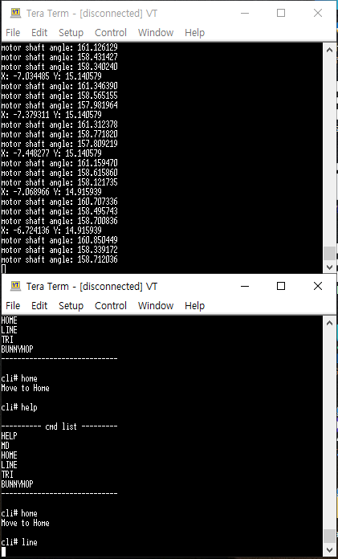

# Ball balancer stm32 inspired by aaedmusa

This project involves porting code written in Arduino C++ to STM32-based C language

## Details
There are 5 changes : 
 - Recalculated the inverse kinematics for 3-RRS model
 - Made the TMC2209 library applicable to TMC2208
 - Can control step motor using UART communication
 - Using a CLI to control ball balancer
 - Improved responsiveness by applying freeRTOS

## Results

## Changelog
- 2024-04-21 First Release
- 2024-05-02 Refactoring
- 2024-05-03 Add a CLI
- 2024-05-04 Include freeRTOS

## Acknowledgements
- Main concept inspired by the [aaedmusa] Ball-Balancer-V2
- https://github.com/aaedmusa/Ball-Balancer-V2.git
- Idea to use a 4-wire resistive touch screen inspired by the [kirp] Adafruit_TouchScreen
- https://github.com/tic-top/Adafruit_TouchScreen.git
- How to use tmc22xx driver inspired by the [veysiadn] tmc_2209
- https://github.com/veysiadn/tmc_2209.git
